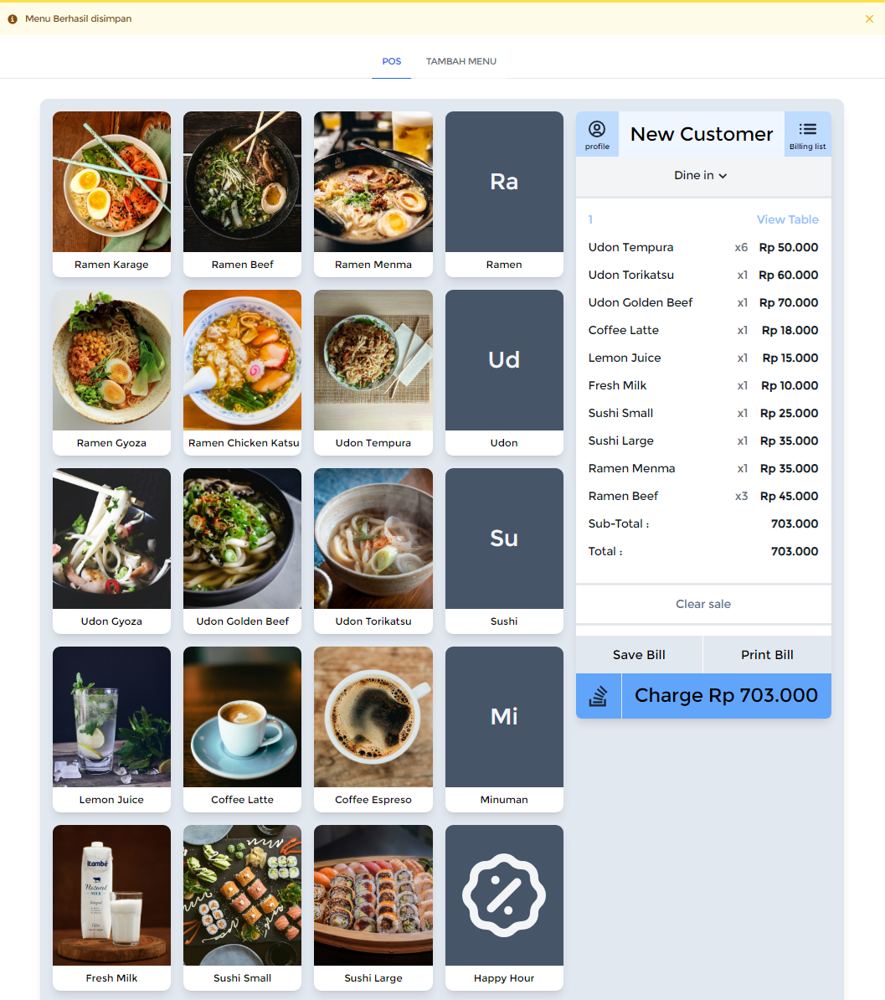
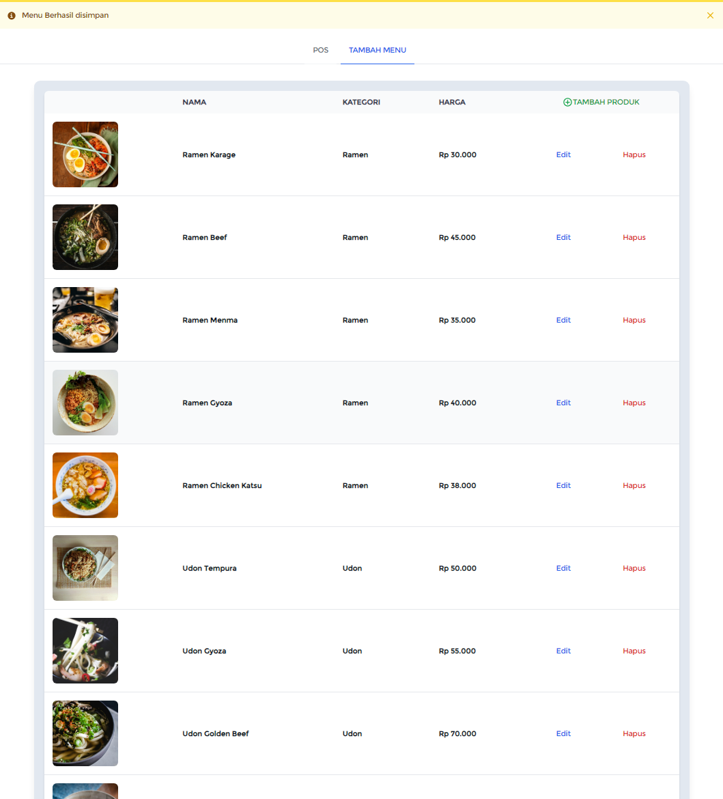

# Point of Sale (POS)

### Update Information
New Feature: Print Bill to PDF with DomPDF
This project now includes the ability to convert content to PDF using dompdf, just a rough code so that the selected menu list can be printed by making it a pdf file.

### Description
This project is a Point of Sale (POS) system built using the Laravel framework. For its frontend, the project utilizes Tailwind CSS with the Flowbite CDN version and native JavaScript. Meanwhile, for the backend, the project relies on Laravel's built-in features. The database used in this project is MySQL, more specifically accessed through PhpMyAdmin.

### Technologies Used
- **Backend Framework:** Laravel
- **Frontend Framework:** Tailwind CSS
- **CDN:** Flowbite
- **Database:** MySQL (accessed via PhpMyAdmin)

### Preview



### Installation and Usage
1. Clone this repository to your local machine.
   ```bash
   git clone https://github.com/Haen0/point_of_sale.git
   ```
2. Navigate to the project directory.
   ```bash
   cd repository_name
   ```
3. Install all the required dependencies using Composer.
   ```bash
   composer install
   ```
   Install DomPDF Package.
   ```bash
   composer require barryvdh/laravel-dompdf
   ```
4. Copy the `.env.example` file to `.env`.
   ```bash
   cp .env.example .env
   ```
5. Configure your database connection in the `.env` file.
   ```
   DB_CONNECTION=mysql
   DB_HOST=database_host_name
   DB_PORT=database_port
   DB_DATABASE=database_name
   DB_USERNAME=database_username
   DB_PASSWORD=database_password
   ```
6. Generate the application key.
   ```bash
   php artisan key:generate
   ```
7. Storage link image.
   ```bash
   php artisan storage:link
   ```
8. Run the migrations to create the necessary tables.
   ```bash
   php artisan migrate
   ```
9. Finally, start the server.
   ```bash
   php artisan serve
   ```
   The project will run at [http://localhost:8000](http://localhost:8000).

If you want to use existing data

1. extract the menu.zip file in this folder, then move it to this directory.
   ```
   storage/app/public/img/menu/
   ```
2. Either dump the data in the menus.sql file or delete the menus table in the database and import the menus.sql file in this folder into the database.

### Additional Notes

- Make sure you have PHP, and Composer installed on your system.
- Create a database in MySQL and update the `.env` file accordingly.
- Tailwind CSS and Flowbite are used for frontend styling; you can customize them as needed.
- Feel free to explore and modify the project according to your requirements.
- internet required to run cdn tailwind 

For more information on Laravel, Tailwind CSS, and other technologies used in this project, refer to their respective documentation:

- [Laravel Documentation](https://laravel.com/docs)
- [Tailwind CSS Documentation](https://tailwindcss.com/docs)
- [Flowbite Documentation](https://flowbite.com/docs)

---

Feel free to reach out if you have any questions or need further assistance with setting up or using this Point of Sale project. Happy coding!

### Contribution
Contributions are always welcome! To propose changes, please create a pull request.

### License
This project is licensed under the [MIT License](https://opensource.org/licenses/MIT).